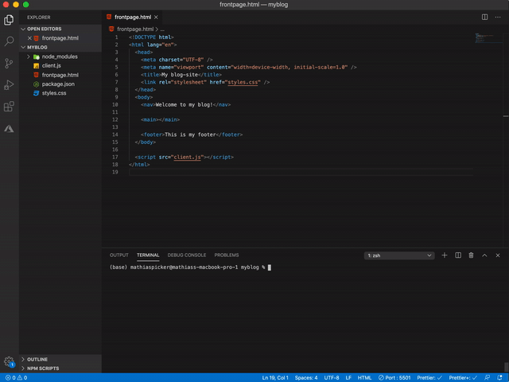
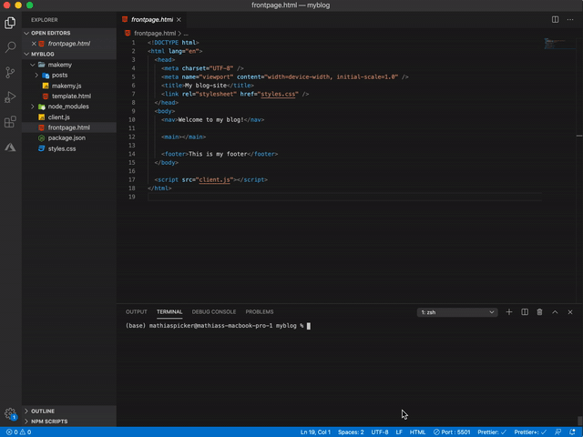
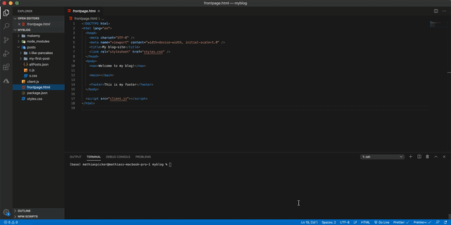
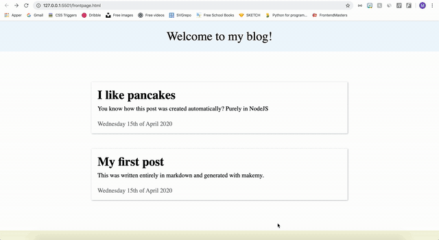

<p align="center">

</p>

## makemy is a tool that parses your text-posts and creates beautiful webpages out of them :heart: 📄

&nbsp;

## Features / Why choose makemy ⭐

- **Works like a charm for static blog-pages!**
- **Simple and logic API**
- **Efficient and uses few dependencies**
- **Supports Markdown**
- **Use your own template super easily**
- **Automatic folder-structuring**
- **Helpful feedback in terminal**
- **Automatically generated JSON for fetching previews of your posts on the client** [(test example)](/test/client.js)
- **Ability to update content of already generated pages**
- **Ability to update templates for already generated pages**
- **Ability to update/alter JSON file**
- **Pre-styled and responsive with CSS, but easily allows for own styling**
- **Follows the GitHub pages structure**

### Extra feature created by makemy :heart:

- **Sugar-language for people that don't want to use markdown (Combination of easy syntax, HTML and normal text-writing)**

#### Extra reading material: [SYNTAX DOCUMENT (SUGAR-PARSER)](/SYNTAX-DOCUMENT.md)

&nbsp;

# How to use:

## 1️. Install

### `npm install makemy`


&nbsp;

## 2️. Run makemy-init to get a pre-made "generator" folder in your project

### `makemy-init`



&nbsp;

## 3. Create your post and template in the project [TEMPLATE EXAMPLE](/test/template.html)



&nbsp;

## Done! ✅

### Now you can create as many posts as you wish! Just run the makemy function to create their HTML-pages.

#### Example of two generated pages, one with markdown and one with the makemy sugar-syntax:



&nbsp;

#### The url to a post would be structured like this: `https://mycoolsite.github.io/posts/post_about_waffles`

&nbsp;

&nbsp;

# API

### - **makemy.page()**

### - **makemy.json()**

### - **makemy.templates()**

&nbsp;

## makemy.page(path-to-directory, [options])

### `options`:

#### REQUIRED OPTIONS:

| Name              | Type     | Description                                                                            |
| ----------------- | -------- | -------------------------------------------------------------------------------------- |
| **template**      | _String_ | name of the HTML file used as the template for the page. Do not write the .html suffix |
| **sourcefoulder** | _String_ | name of folder where the written post is.                                              |
| **postname**      | _String_ | name of post.                                                                          |

#### VOLUNTARY OPTIONS:

| Name          | Type      | Description                                                                                                             |
| ------------- | --------- | ----------------------------------------------------------------------------------------------------------------------- |
| **location**  | _String_  | path (relative to `__dirname`) to where the "posts"-folder should be created.                                           |
| **extension** | _String_  | type of extension used on the document.                                                                                 |
| **update**    | _Boolean_ | choose if a post should be updated (if you want to re-generate the same post), is false by default                      |
| **sugar**     | _Boolean_ | set to true if you want to use the sugar-parser created by makemy [SYNTAX DOCUMENT (SUGAR-PARSER)](/SYNTAX-DOCUMENT.md) |

#### Example of using makemy.page to update an already existing page:



#### Code example:

```js
const makemy = require('makemy');

const options = {
  template: 'template',

  sourcefolder: 'posts',

  postname: 'my-first-post',

  location: '../',

  update: true
};

makemy.page(__dirname, options);
```

&nbsp;

## makemy.json(path-to-directory, [options])

#### NOTE: ONLY USE IF YOU WANT TO UPDATE/REGENERATE THE JSON FILE. NO NEED TO RUN THIS FUNCTION WHEN YOU CREATE A PAGE AS THE makemy.page FUNCTION DOES THIS BY ITSELF.

### `options`:

#### VOLUNTARY OPTIONS:

| Name      | Type     | Description                                                                                      |
| --------- | -------- | ------------------------------------------------------------------------------------------------ |
| **order** | _String_ | what order the posts in the json file should be. Options are ascending (default) and descending. |

#### Example:

```js
const options = {
  order: 'descending'
};

makemy.json(__dirname, options);
```

&nbsp;

## makemy.templates(path-to-directory, [options])

### NOTE: THIS IS USED FOR UPDATING TEMPLATES ON ALREADY GENERATED PAGES

### `options`:

#### REQUIRED OPTIONS:

| Name         | Type     | Description                   |
| ------------ | -------- | ----------------------------- |
| **template** | _String_ | name of the new HTML template |
| **posts**    | \*String | Array\*                       | the posts that should have their tempalte updated. Can either be an array with names or just the string 'all'. |

#### Example:

```js
const options = {
  template: 'summer-template',
  posts: 'all'
};

makemy.template(__dirname, options);
```

&nbsp;

&nbsp;

#### If you have any questions or just want to chat, then send me an 📧 at mathiaswpicker@gmail.com

Have a nice day!

-- Mathias
